<div align="center">

<h1>📚 Paper Review Harness</h1>
<h3>面向 Codex 的可追溯论文讨论、审查、修改与验收系统</h3>
<p>把“模型觉得论文改好了”，升级为一条<strong>有状态、可审计、可验证、可阻断</strong>的学术质量控制链。</p>
<p>
  <a href="https://openai.com/codex/"></a>
  <a href="https://www.python.org/"></a>
  <a href="https://json-schema.org/"></a>
  <a href="pyproject.toml"></a>
</p>
<p><strong>自然语言输入 · 分层审查 · 独立验证 · 硬性门槛 · 完整溯源</strong></p>
<p>
  <a href="#quick-start">快速开始</a> ·
  <a href="#system-overview">工作方式</a> ·
  <a href="#quality-gates">质量门槛</a> ·
  <a href="#provenance">日志溯源</a> ·
  <a href="#scientific-validators">扩展接口</a>
</p>

</div>

---

> [!IMPORTANT]
> Agent 负责理解论文、提出判断和执行受控修改；Python Harness 负责状态转换、Schema 校验、账本一致性以及是否允许最终验收。

## ✨ 为什么需要它

普通的论文修改对话容易丢失上下文，也很难回答三个关键问题：**改了什么、为什么改、凭什么认为已经修好**。

| 普通论文对话 | Paper Review Harness |
|---|---|
| 结论散落在聊天记录里 | Claim、Issue、Revision、Verification 全部进入账本 |
| 局部润色可能悄悄改变主张 | 上层契约、术语、符号、数据和 Claim 范围共同约束修改 |
| 修改者自己宣布“已解决” | 只有独立 Verifier 的 `PASS` 才能关闭 Issue |
| “看起来没问题”即可结束 | 确定性 Gate 未通过就不能进入 `ACCEPT` |
| 修改后旧审查结果可能继续被误用 | 源文件哈希变化会让不变量账本自动失效 |
| 日志难以复核 | 哈希链事件流、结构化输入输出和对话溯源文档 |

<a id="system-overview"></a>

## 🧭 系统如何工作

```mermaid
flowchart LR
    U["自然语言请求"] --> R["结构化 Request"]
    R --> A{"Admission<br/>17 项准入检查"}
    A -->|通过| C["Claim Mapping"]
    A -->|拒绝| B["返回具体阻塞项"]
    C --> I["Registries +<br/>Argument Graph"]
    I --> M["Global Contract"]
    M --> H["Section / Subsection<br/>Hierarchy"]
    H --> G["Selected Granularity"]
    G --> V["Independent Review"]
    V --> X["Revision"]
    X --> Y["Independent Verification"]
    Y --> Z["Remap Changed Facts"]
    Z --> F["Final Audit"]
    F --> D{"Deterministic Gates"}
    D -->|PASS| OK["ACCEPT"]
    D -->|FAIL| X

    classDef gate fill:#7c3aed,color:#fff,stroke:#5b21b6;
    classDef success fill:#059669,color:#fff,stroke:#047857;
    classDef blocked fill:#dc2626,color:#fff,stroke:#991b1b;
    class A,D gate;
    class OK success;
    class B blocked;
```



### 三层控制面

| 层级 | 主要产物 | 作用 |
|---|---|---|
| **学术不变量层** | 术语、符号、数据、论证图、Claim 一致性、冗余账本 | 防止论文自相矛盾、断链或失去可追溯性 |
| **结构控制层** | Global Contract、章节树、细粒度审查 | 保证标题、摘要、章节、结论和局部表达围绕同一主题展开 |
| **执行与治理层** | Request、Admission、Issue、Revision、Verification、Audit | 控制谁可以修改、何时可以关闭问题、何时允许验收 |

<a id="quick-start"></a>

## 🚀 快速开始

### 1. 放入论文仓库

将下列目录复制到 LaTeX 论文仓库根目录：

```text
AGENTS.md
.codex/
.agents/
.review/
scripts/
```

> [!CAUTION]
> 如果论文仓库已有 `AGENTS.md`，请合并 Paper Review Harness 段落，不要直接覆盖原文件。

### 2. 配置论文入口

编辑 `.review/config.json`，并保留模板中的其他默认字段：

```json
{
  "main_tex": "manuscript/main.tex",
  "manuscript_roots": ["manuscript"],
  "figure_roots": ["figures"],
  "evidence_roots": ["data", "artifacts"],
  "bibliography_files": ["manuscript/references.bib"],
  "build_command": ["latexmk", "-pdf", "{main_tex}"]
}
```

位于正文目录之外、但参与数据或证据一致性判断的材料，应加入 `evidence_roots`。

### 3. 安装运行时依赖

```powershell
python -m pip install "jsonschema>=4.21"
```

### 4. 检查状态

```powershell
python scripts/review.py status
python scripts/control.py status
python scripts/control.py verify-log
```

### 5. 直接用自然语言开始

```text
使用 $paper-review-operator 对论文做完整独立审查，先告诉我准入结果。
```

你不需要自己填写 JSON。`paper-review-operator` 会完成结构化输入、必要追问、准入、启动、查看、溯源和监控。

## 💬 常用请求

```text
使用 $paper-review-operator 讨论 C07 的全局最优性主张，不要修改论文。

使用 $paper-review-operator 完整审查这篇论文，粒度选择自适应。

使用 $paper-review-operator 修复所有 BLOCKER 和 CORE Claim 上的 MAJOR，
修改前让我确认范围，修改后交给独立 Verifier。

使用 $paper-review-operator 查看当前流程状态，并告诉我下一步需要做什么。

使用 $paper-review-operator 生成本次会话的完整溯源文档。
```

## 🎛️ 工作模式

| 模式 | 是否修改正文 | 结果 |
|---|:---:|---|
| `DISCUSS` | 否 | 证据、反方挑战、未决选择及选择后果 |
| `REVIEW` | 否 | 分层审查结果与结构化 Issues |
| `REVISE` | 是 | 最小可辩护修改，Issue 仅进入 `CLAIMED_FIXED` |
| `VERIFY` | 否 | 独立验证结果：`PASS / PARTIAL / FAIL / NEW_PROBLEM` |
| `OPTIMIZE` | 是 | 在无高层 Blocker 的前提下优化逻辑与表达 |
| `FULL` | 是 | 审查、修改、验证、终审和确定性验收闭环 |

`REVISE`、`OPTIMIZE` 和 `FULL` 必须先向用户展示归一化范围并获得确认。

<details>
<summary><strong>查看等价命令行操作</strong></summary>

```powershell
python scripts/control.py intake --text "完整审查论文，不修改正文"
python scripts/control.py admit REQ-ID
python scripts/control.py start REQ-ID --dry-run
python scripts/control.py start REQ-ID
```

修改型请求需要先确认：

```powershell
python scripts/control.py confirm REQ-ID
python scripts/control.py admit REQ-ID
python scripts/control.py start REQ-ID
```

底层入口同样需要一个已通过准入的 Request：

```powershell
python scripts/review.py run --mode review --request REQ-ID --dry-run
```

</details>

## 🔎 分层审查与粒度

系统不会一开始就钻进句子，而是先冻结上层约束，再逐层向下：

```text
claims.json
  ├─ terminology.json
  ├─ notation.json
  ├─ data_consistency.json
  ├─ argument_graph.json
  ├─ claim_consistency.json
  └─ redundancy.json
       ↓
global_contract.json
       ↓
structure.json
       ↓
granular_review.json
       ↓
Issue → Revision → Verification
       ↓
remap changed facts → final_audit.json
```

### 审查粒度

| 粒度 | 覆盖范围 | 适合场景 |
|---|---|---|
| `MACRO_ONLY` | 标题、摘要、章节名、结论、核心逻辑链 | 先判断论文整体方向 |
| `SECTION` | 宏观层 + 一级章节 | 快速结构审查 |
| `SUBSECTION` | 宏观层 + 所有章节和小节 | 常规深度审查 |
| `PARAGRAPH` | 所有上层结构 + 每个段落 | 详细修改前检查 |
| `SENTENCE` | 所有句子 | 终稿、返修稿或重点短文 |
| `ADAPTIVE` | 全文逐段，高风险位置逐句 | 推荐的质量与成本平衡方案 |

粒度必须由用户明确选择；未选择时，准入门 `A14` 会拒绝执行。

### Humanizer 边界

语言、段落逻辑和局部衔接由 `language_coherence_reviewer` 强制加载 `$humanizer`。它可以改变表达形式，但不得改变：

- 科学事实、数据和数值；
- 引用、公式和符号含义；
- 限定条件、Claim 范围和作者立场；
- 上层章节目的与核心逻辑链。

缺少该 Skill 时，准入门 `A15` 会阻止分层任务。

## 🧩 结构化账本

### 流程账本

| 账本 | 记录内容 |
|---|---|
| `claims.json` | 主张、范围、强度、依赖、证据和审查历史 |
| `issues.json` | 问题、严重度、位置、修复要求和验证标准 |
| `revisions.json` | 修改文件、位置、影响 Claim 和修改类型 |
| `verifications.json` | 独立验证结论及当前文本证据 |

### 学术不变量账本

| 账本 | 机器维护的不变量 |
|---|---|
| `terminology.json` | 一个概念对应一个规范术语及允许别名 |
| `notation.json` | 一个符号对应稳定的含义、类型和定义 |
| `data_consistency.json` | 同一数据在相同条件下保持值与单位一致 |
| `argument_graph.json` | Claim 由哪些前提、证据、数据或推导支撑 |
| `claim_consistency.json` | 摘要、正文、结论中的 Claim 是否同步 |
| `redundancy.json` | 完全重复、重复贡献与非阻断语义相似诊断 |

所有不变量账本均绑定逐文件 SHA-256。论文发生修改后，旧账本会标记为 `STALE`，必须重新映射。

<a id="quality-gates"></a>

## 🚦 确定性质量门槛

正式验收：

```powershell
python scripts/review.py validate --final
```

只读诊断：

```powershell
python scripts/validators.py --final
```

### 跨论文不变量 Gate

| Gate | 检查内容 | 失败示例 |
|---|---|---|
| `G16` | 六类不变量账本新鲜度 | 论文已修改，但 registry 仍对应旧哈希 |
| `G17` | 术语一致性 | 同一缩写被定义为两个概念 |
| `G18` | 符号与定义一致性 | 同一符号从向量变成标量 |
| `G19` | 论证图完整性 | CORE Claim 没有支撑源或依赖断链 |
| `G20` | 数据一致性 | 表格与结论在相同条件下报告不同数值 |
| `G21` | Claim 一致性 | 结论比正文主张更强，或摘要未同步修改 |
| `G22` | 结构性冗余 | 同一 Claim 被包装为两个独立贡献 |
| `G23 / SV-*` | 论文自带科学校验器 | 复现实验失败、矩阵秩不一致等 |

> [!NOTE]
> 这里采用“LLM 负责理解并结构化，程序负责执行不变量”的边界。Gate 能证明已登记事实之间没有违反规则，但不等于数学真理或实验真实性已被形式证明。

### 什么不会被武断设为硬门槛

- 摘要与结论适度重述核心结果；
- Introduction 概述方法；
- Discussion 重述并解释实验发现；
- 两个段落语义相近；
- 句子偏长、转折不够自然或文风不够漂亮。

这些问题进入诊断或修改建议，不会仅凭相似度直接阻止验收。

<a id="scientific-validators"></a>

## 🧪 可插拔科学校验器

通用 Harness 不内置 `group_closure`、`rank_consistency`、`data_reproduction` 等具体学科判据。论文可以按需挂载自己的 validator：

```json
{
  "scientific_validators": [
    {
      "id": "data_reproduction",
      "command": [
        "python",
        "validators/data_reproduction.py",
        "--root",
        "{root}"
      ],
      "required": true,
      "timeout_seconds": 300
    }
  ]
}
```

Validator 仅在 `--final` 时运行，并必须在 stdout 返回一个 JSON 对象：

```json
{
  "validator_id": "data_reproduction",
  "status": "PASS",
  "summary": "All reported values were reproduced.",
  "evidence": ["artifacts/reproduction-report.json"]
}
```

可用占位符：`{root}`、`{main_tex}`、`{main_dir}`、`{main_name}`。

当 `required: true` 时，命令失败、超时、非法 JSON、Schema 不匹配、ID 不一致、`FAIL` 或 `NEEDS_AUTHOR` 都会阻止验收。可选 validator 只生成诊断结果。

<a id="provenance"></a>

## 🧾 日志、溯源与监控

```text
.review/
  logs/events.jsonl                         # 追加式哈希链事件流
  requests/REQ-*.json                       # 规范化请求
  admission/REQ-*.json                      # 程序化准入结果
  runs/<run-id>/
    run.json
    agents/<invocation-id>/
      input.json                            # 结构化输入与配置哈希
      output.json                           # Schema 合法的结构化输出
      events.jsonl                          # Codex 调用事件
      stderr.log
      invocation.json                       # 调用清单与状态
      effective-schema.json
  scientific-validation/<run-id>/result.json
  provenance/conversations/<session-id>.json
  provenance/conversations/<session-id>.md
```

敏感字段会在持久化前脱敏；原始载荷、命令、stdout 和 stderr 保留 SHA-256。事件记录包含前一事件哈希，因此可以检测内容、顺序或链关系是否被改写。

```powershell
python scripts/control.py status
python scripts/control.py monitor --once
python scripts/control.py monitor --interval 5 --timeout 300
python scripts/control.py verify-log
python scripts/control.py trace --session SESSION-ID
```

## 🔒 关键安全边界

1. Reviewer、Mapper、Challenger 和 Verifier 只读。
2. 只有 `REVISION` 阶段的 `reviser` 可以修改论文。
3. Reviser 只能把 Issue 标为 `CLAIMED_FIXED`，不能标为 `RESOLVED`。
4. 只有独立 Verifier 的 `PASS` 可以关闭 Issue。
5. 不得编造数据、引用、证明、假设、实验结果或作者意图。
6. `BLOCKER` 和作用于 CORE Claim 的未解决 `MAJOR` 会阻止验收。
7. 编译成功只是必要条件，不是科学正确性的证明。
8. 达到最大轮数仍未收敛时进入 `BLOCKED`，绝不会自动视为通过。

Hooks 提供会话级守门，Python 状态机独立执行同一组核心规则。首次启用或脚本变化后，请在 Codex CLI 中使用 `/hooks` 审核并信任项目 Hook。

## 🗂️ 项目结构

```text
paper-review-harness/
  AGENTS.md                         # 项目级协作与硬规则
  .agents/skills/
    paper-review/                   # 科学工作流 Skill
    paper-review-operator/          # 自然语言控制面 Skill
  .codex/
    agents/                         # 14 个 Custom Agent
    hooks/                          # 写入、输出、停止与审计 Hook
  .review/
    schemas/                        # Request、账本与 Agent 输出 Schema
    config.json                     # 论文入口、Gate 与扩展配置
    *.json                          # 初始状态和账本模板
  scripts/
    control.py                      # Intake、操作、查看、溯源、监控
    review.py                       # 工作流编排与状态机
    validators.py                   # 确定性验收门槛
    provenance.py                   # 哈希链日志与对话溯源
  tests/
    test_harness.py                 # 行为与不变量回归测试
```

## ✅ 开发自检

```powershell
ruff check .
python -m compileall -q scripts tests .codex/hooks
python -m unittest discover -s tests -v
```

当前版本包含对准入、结构化输出、权限边界、哈希链、术语/符号冲突、论证断链、数据一致性、Claim 范围漂移、registry 失效和可插拔科学 validator 的回归测试。

## 🧱 扩展边界

控制面与科学工作流保持分离：

```text
paper-review-operator
  └─ 用户意图、结构化输入、准入、启动、查看、溯源、监控

paper-review
  └─ Claim → Invariants → Issue → Revision → Verification → Acceptance
```

未来可以新增 defender、judge、PDF/presentation reviewer、fresh reviewer 或论文自带 scientific validator，但不得绕过 Request、Admission、Audit、registry freshness 和独立验证状态转换。

---

<div align="center">

<p><strong>Paper Review Harness</strong> — 让论文修改过程不仅可读，而且可追溯、可验证、可复现。</p>

</div>
